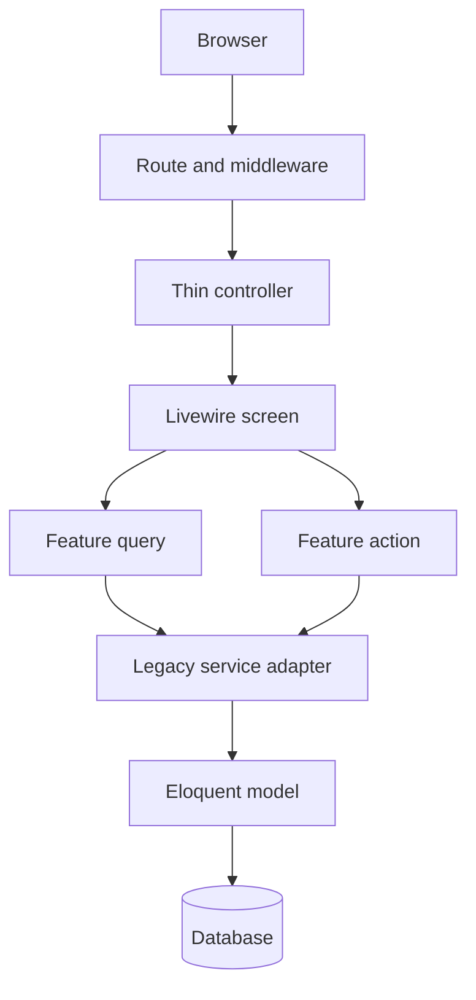

# FlowTrack architecture

FlowTrack is a Laravel 13 and Livewire 4 modular monolith. It keeps one deployment unit and one transactional database while enforcing feature boundaries in source code. This is the appropriate operating model for the current team and an expected concurrent audience of roughly 50–60 people: it avoids distributed-system overhead while preserving a clean path to split workloads later.

## Request flow



The `Legacy service adapter` is intentionally temporary. New presentation code must enter a feature through a Query or Action. Existing service behavior is retained behind those interfaces until each workflow has regression coverage and can be moved safely.

## Backend layout

```text
app/
├── Features/
│   ├── Orders/
│   │   ├── Actions/       # one write use case per class
│   │   └── Queries/       # permission-scoped read models
│   └── Inquiries/
│       ├── Actions/       # product, task, document and decision commands
│       └── Queries/       # list/detail read boundaries
├── Http/
│   ├── Controllers/       # transport only; no route closure logic
│   └── Middleware/        # security, locale, session and performance policy
├── Livewire/              # UI state and orchestration
│   ├── Jobs/Concerns/     # composed Order workflow behavior
│   └── Inquiries/Concerns/# composed Inquiry workflow behavior
├── Models/                # persistence and relationships
├── Services/              # legacy adapters and shared infrastructure
└── Support/               # pure helpers and presenters
```

### Backend rules

1. Controllers validate transport concerns and delegate.
2. Livewire components coordinate UI state; business writes belong in Actions.
3. Queries must apply authorization scope before reading records.
4. Actions accept a user/actor explicitly and re-check authorization in the service or policy layer.
5. Transactions, audit activity and notifications stay together at the write boundary.
6. Feature classes may depend on shared infrastructure; shared infrastructure must not depend on Livewire.
7. No request-handling closure belongs in a route file.

## Frontend layout

```text
resources/
├── css/
│   ├── foundation/        # tokens and resets
│   ├── layouts/           # application shell, sidebar and responsive rules
│   ├── components/        # reusable UI elements
│   ├── modules/           # domain-owned styles grouped by screen family
│   ├── pages/             # route-level Vite composition entries
│   ├── utilities/         # narrowly scoped utilities
│   └── legacy/            # frozen compatibility rules awaiting migration
└── js/
    ├── core/              # session, navigation, realtime, timezone
    ├── components/        # reusable DOM behavior
    ├── features/          # feature-specific behavior
    └── app.js             # composition root only
```

`resources/js/app.js` is the authenticated JavaScript entry and imports the shared `resources/css/app.css` shell. `PageAssetResolver` adds one route-specific entry from `resources/css/pages`, so a user downloads only the active feature CSS instead of the whole application stylesheet. The login screen has its own small entry point. Vite owns compilation, hashing and the production manifest. `public/css` and `public/js` are intentionally empty; generated output belongs only in `public/build` and is never edited manually. The source repository may ignore that directory, while release archives may include a verified build so Laravel can resolve `@vite` immediately.

### Frontend rules

1. Blade contains semantic markup and Livewire/Alpine bindings, never `<style>` blocks, `style` attributes, raw DOM event attributes or manual source asset tags.
2. Static styling belongs in the smallest relevant CSS module.
3. Validated runtime values are passed with typed `data-*` attributes and enhanced by `dynamic-styles.js`.
4. Reusable browser behavior is initialized idempotently and must survive `livewire:navigated`.
5. Images use lazy loading and asynchronous decoding where appropriate.
6. New rules must never be added to `legacy/historical-overrides.css`; migrate an owned section instead.
7. New feature CSS must be imported by the appropriate `resources/css/pages` entry, not the global application core.
8. Page entries contain imports and comments only. Selectors belong in `components` or a domain folder under `modules`.
9. Run `npm run css:format` after editing source CSS and `npm run css:check` before committing.

## Security boundaries

- Authentication and module permissions remain route middleware concerns.
- Record visibility is applied to database queries before hydration.
- CSRF protection remains enabled; recovery only refreshes a stale session token.
- Security headers include clickjacking, MIME sniffing, referrer and permissions protection.
- CSP ships in report-only mode until production telemetry proves all Livewire and third-party behavior is compatible; then it should be enforced.
- HSTS is emitted only for HTTPS production requests.
- User locale is allow-listed (`en`, `zh`) before application.
- Release packages exclude `.env`, SQLite data, logs, dependencies and runtime uploads. A verified Vite build may be included as deployable output.
- Eloquent models use explicit `$fillable` lists; primary keys, timestamps and soft-delete fields are not mass assignable.

## Performance and scale

- Use pagination and bounded remote selectors; never hydrate full catalogs for a list screen.
- Select only rendered columns and eager-load only rendered relationships.
- Move email, spreadsheet and expensive notification fan-out to queues.
- Use Redis for shared cache/session/queues in multi-instance production.
- Run Reverb and queue workers as supervised processes, separate from PHP web workers.
- Cache framework configuration, events, routes and views during deploy.
- Measure p95 response time, slow queries, queue delay, error rate and WebSocket reconnects.
- Load-test the three busiest workflows with at least 60 authenticated virtual users before production acceptance.

## International UX

Browser timezone synchronization and the user locale are applied centrally. Dates should be stored in UTC and formatted through `WorkspaceSettingsService`. English and Simplified Chinese are the currently allow-listed locale codes. Most existing interface copy is still embedded in views; future feature work must move user-facing strings into `lang/en` and `lang/zh` before claiming full translation coverage.

## Definition of done

A change is complete when formatting, application tests, architecture tests and the production Vite build pass in CI; authorization is tested for allowed and denied users; list queries are bounded; and no source CSS/JS or environment data is written to `public` or committed.
